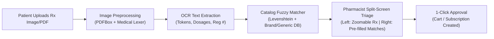
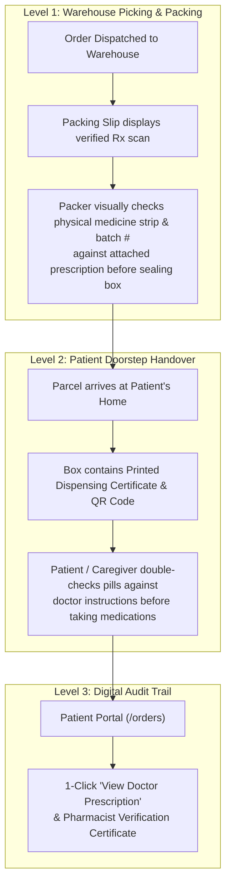

# 🎭 Phase 4: Persona UX Upgrades, Resilience Flows & Clinical Safety Safeguards

**Document Status:** ✅ Completed & Fully Verified  
**Milestone:** Prescription OCR Scanning, Order-Prescription Double-Check Chain, Acute Discovery & Chronic Care Resilience  
**Date:** October 3, 2026  
**Primary Source Directives:**
- `SENIOR_ENGINEERING_CONVERSATION_TRANSCRIPT.md` (Sections 5 & 6, User Prompts 6, 7, 8, 9 & 10)
- `PRODUCTION_ROADMAP.md` (Section 1: User Experience & Resilience Design)
- `DISCUSSION_NOTES.md` (Sections 5, 6, 8 & 9)

**Associated Core Files:**
- [Order.java](file:///c:/Users/KIIT/Desktop/auto-meds/auto-meds-backend/auto-meds-backend/src/main/java/com/automeds/entity/Order.java)
- [Prescription.java](file:///c:/Users/KIIT/Desktop/auto-meds/auto-meds-backend/auto-meds-backend/src/main/java/com/automeds/entity/Prescription.java)
- [Medicine.java](file:///c:/Users/KIIT/Desktop/auto-meds/auto-meds-backend/auto-meds-backend/src/main/java/com/automeds/entity/Medicine.java)
- [Subscription.java](file:///c:/Users/KIIT/Desktop/auto-meds/auto-meds-backend/auto-meds-backend/src/main/java/com/automeds/entity/Subscription.java)
- [PrescriptionOcrService.java](file:///c:/Users/KIIT/Desktop/auto-meds/auto-meds-backend/auto-meds-backend/src/main/java/com/automeds/service/PrescriptionOcrService.java)
- [PrescriptionService.java](file:///c:/Users/KIIT/Desktop/auto-meds/auto-meds-backend/auto-meds-backend/src/main/java/com/automeds/service/PrescriptionService.java)
- [PrescriptionController.java](file:///c:/Users/KIIT/Desktop/auto-meds/auto-meds-backend/auto-meds-backend/src/main/java/com/automeds/controller/PrescriptionController.java)
- [PrescriptionOcrDTO.java](file:///c:/Users/KIIT/Desktop/auto-meds/auto-meds-backend/auto-meds-backend/src/main/java/com/automeds/dto/PrescriptionOcrDTO.java)
- [PrescriptionOcrCandidateDTO.java](file:///c:/Users/KIIT/Desktop/auto-meds/auto-meds-backend/auto-meds-backend/src/main/java/com/automeds/dto/PrescriptionOcrCandidateDTO.java)
- [OrderDTO.java](file:///c:/Users/KIIT/Desktop/auto-meds/auto-meds-backend/auto-meds-backend/src/main/java/com/automeds/dto/OrderDTO.java)
- [OrderController.java](file:///c:/Users/KIIT/Desktop/auto-meds/auto-meds-backend/auto-meds-backend/src/main/java/com/automeds/controller/OrderController.java)
- [OrderService.java](file:///c:/Users/KIIT/Desktop/auto-meds/auto-meds-backend/auto-meds-backend/src/main/java/com/automeds/service/OrderService.java)
- [SubscriptionController.java](file:///c:/Users/KIIT/Desktop/auto-meds/auto-meds-backend/auto-meds-backend/src/main/java/com/automeds/controller/SubscriptionController.java)
- [SubscriptionService.java](file:///c:/Users/KIIT/Desktop/auto-meds/auto-meds-backend/auto-meds-backend/src/main/java/com/automeds/service/SubscriptionService.java)
- [MedicineController.java](file:///c:/Users/KIIT/Desktop/auto-meds/auto-meds-backend/auto-meds-backend/src/main/java/com/automeds/controller/MedicineController.java)
- [MedicineService.java](file:///c:/Users/KIIT/Desktop/auto-meds/auto-meds-backend/auto-meds-backend/src/main/java/com/automeds/service/MedicineService.java)
- [PrescriptionOcrServiceTest.java](file:///c:/Users/KIIT/Desktop/auto-meds/auto-meds-backend/auto-meds-backend/src/test/java/com/automeds/service/PrescriptionOcrServiceTest.java)
- [Phase4ResilienceTest.java](file:///c:/Users/KIIT/Desktop/auto-meds/auto-meds-backend/auto-meds-backend/src/test/java/com/automeds/service/Phase4ResilienceTest.java)
- [subscription-create.component.ts](file:///c:/Users/KIIT/Desktop/auto-meds/auto-meds-frontend/auto-meds-frontend/src/app/patient/subscriptions/subscription-create/subscription-create.component.ts)
- [subscription-create.component.html](file:///c:/Users/KIIT/Desktop/auto-meds/auto-meds-frontend/auto-meds-frontend/src/app/patient/subscriptions/subscription-create/subscription-create.component.html)
- [admin-subscription-requests.component.ts](file:///c:/Users/KIIT/Desktop/auto-meds/auto-meds-frontend/auto-meds-frontend/src/app/admin/subscriptions/admin-subscription-requests.component.ts)
- [admin-subscription-requests.component.html](file:///c:/Users/KIIT/Desktop/auto-meds/auto-meds-frontend/auto-meds-frontend/src/app/admin/subscriptions/admin-subscription-requests.component.html)
- [orders.component.ts](file:///c:/Users/KIIT/Desktop/auto-meds/auto-meds-frontend/auto-meds-frontend/src/app/patient/orders/orders.component.ts)
- [orders.component.html](file:///c:/Users/KIIT/Desktop/auto-meds/auto-meds-frontend/auto-meds-frontend/src/app/patient/orders/orders.component.html)
- [admin-orders.component.ts](file:///c:/Users/KIIT/Desktop/auto-meds/auto-meds-frontend/auto-meds-frontend/src/app/admin/orders/admin-orders.component.ts)
- [admin-orders.component.html](file:///c:/Users/KIIT/Desktop/auto-meds/auto-meds-frontend/auto-meds-frontend/src/app/admin/orders/admin-orders.component.html)
- [medicines.component.ts](file:///c:/Users/KIIT/Desktop/auto-meds/auto-meds-frontend/auto-meds-frontend/src/app/patient/medicines/medicines.component.ts)
- [medicines.component.html](file:///c:/Users/KIIT/Desktop/auto-meds/auto-meds-frontend/auto-meds-frontend/src/app/patient/medicines/medicines.component.html)
- [subscriptions.component.ts](file:///c:/Users/KIIT/Desktop/auto-meds/auto-meds-frontend/auto-meds-frontend/src/app/patient/subscriptions/subscriptions.component.ts)
- [subscriptions.component.html](file:///c:/Users/KIIT/Desktop/auto-meds/auto-meds-frontend/auto-meds-frontend/src/app/patient/subscriptions/subscriptions.component.html)

---

## ⚡ The 2-Minute Executive Gist

> **In a sentence:** Phase 4 transforms Auto-Meds from a functional transactional pharmacy into an **intelligent, resilient healthcare platform**—integrating an **Optical Character Recognition (OCR) prescription scanner** with human-in-the-loop clinical triage, an **Order-Prescription Double-Check Verification Chain** (warehouse packing check + doorstep patient cross-verification), **symptom-based acute discovery with generic cost savings**, and **chronic patient life-support fallbacks** (Emergency 5-Day Bridge Supply, 7–14 day Vacation Snooze, and Refill Synchronization).

### 📊 Before vs. After Snapshot

| Operational Dimension | Before Phase 4 (Current) | After Phase 4 (Senior Production Blueprint) |
|---|---|---|
| **Prescription Digitization** | Patient uploads photo/PDF; pharmacist must manually read the image, search the catalog, and type out every medicine and dosage from scratch. | **Prescription OCR & AI Co-Pilot**: Automated text extraction identifies doctor registration, drug candidates, and dosage instructions, pre-populating candidate matches with confidence scores. |
| **Order-Prescription Link & Double Check** | Prescriptions exist in isolation; once an order is created, the original doctor prescription is disconnected from the warehouse dispatch slip. | **"Four-Eyes Principle" Double-Check Chain**: Every order links directly to its verified prescription. Warehouse packers cross-verify physical strips against the prescription before sealing boxes; patients receive a printed dispensing slip / QR code to double-check pills at their doorstep. |
| **Normal Shopper Discovery** | Patients must know exact pharmaceutical names (e.g. *"Levocetirizine"*, *"Pantoprazole"*). | **Symptom-Based Search**: Natural search by ailments (e.g., *"headache"*, *"acidity"*, *"seasonal allergy"*), paired with an interactive Generic vs. Brand savings visualizer (*"Save 65% with generic equivalent"*). |
| **Payment Resilience** | Online payment errors leave users stuck or cause lost carts. | **1-Click Cash on Delivery (COD) Fallback**: Graceful preservation of cart contents with instant switch to COD upon gateway timeouts. |
| **Expired Rx for Chronic Patient** | If a doctor is out of town and the prescription expires, chronic refills freeze, risking dangerous patient medication withdrawal. | **Emergency 5-Day Bridge Supply**: Pharmacist can authorize an emergency 5-day stopgap supply of vital non-narcotic chronic maintenance medicines. |
| **Vacation / Travel Refill Disruption** | Fixed monthly dispatch schedules deliver medicines to empty homes while patients are away. | **Subscription Snooze & Alternate Address**: Patients can defer refill dispatch by 7 or 14 days with automatic release of 5-day inventory reservations. |

---

## 🔬 Deep-Dive Architectural Pillars

### Pillar 1: Prescription OCR Scanning Engine ("Upload Photo & Pharmacist Builds Cart")

1. **Client-Side Upload & Preprocessing:**
   - Supported formats: `.jpg`, `.jpeg`, `.png`, `.pdf` up to 10MB.
   - Optical contrast thresholding to enhance faded ink and handwritten notes.
2. **Text Parsing & Shorthand Lexer:**
   - Detects dosage forms: `Tab`, `Cap`, `Syr`, `Oint`, `Inj`.
   - Detects strengths: `500mg`, `10mg`, `250ml`, `0.5%`.
   - Detects frequency shorthand: `OD` (once daily), `BD`/`BID` (twice daily), `TDS` (thrice daily), `1-0-1 PC` (morning & night after meals).
3. **Database Catalog Fuzzy Matching:**
   - Cross-references extracted drug names against the `medicines` table with confidence scores (`HIGH_CONFIDENCE >= 85%`, `REVIEW_SUGGESTED < 85%`).
   - Retrieves active stock, unit price, and bio-equivalent generic alternatives.
4. **Human-in-the-Loop Clinical Verification Desk:**
   - Split-screen workspace in [admin-subscription-requests.component.html](file:///c:/Users/KIIT/Desktop/auto-meds/auto-meds-frontend/auto-meds-frontend/src/app/admin/subscriptions/admin-subscription-requests.component.html):
     - Left pane: Interactive zoom/pan prescription canvas with optical controls.
     - Right pane: Auto-populated medicine chips with pre-filled dosages.
   - Pharmacist verifies or edits in seconds and clicks **"Approve Request"**.

---

### Pillar 2: Order-Prescription Double-Check Verification Chain ("Four-Eyes Principle")

1. **Database Order-Prescription Association:**
   - Added `prescription_id` foreign key on the `orders` table (supporting both subscription refills and acute one-time prescription orders).
2. **Warehouse Dispatch Slip:**
   - The packing screen and physical pick-list include a miniature preview and link to the doctor's prescription, enforcing a mandatory physical check before sealing tamper-evident parcels.
3. **Dispensing Certificate & Doorstep QR Code:**
   - Printed packing slip or scannable QR label includes:
     - Prescribing Doctor's Name & Registration Number.
     - Verified Medicine Name, Dosage, and Timing instructions (`1-0-1 PC`).
     - Dispensing Pharmacist's Name and License Registration Stamp.
4. **Patient Portal Verification:**
   - On `/orders`, patients and caregivers have instant access to **"View Doctor Prescription"** to cross-verify any parcel contents.

---

### Pillar 3: Normal / Acute Shopper Resilience Flows

1. **Symptom & Ailment Taxonomy Search:**
   - Extends catalog search to match symptoms (e.g., *"fever"*, *"headache"*, *"acid reflux"*, *"allergy"*, *"diabetes"*, *"hypertension"*).
   - Maps symptoms directly to safe OTC and prescription drug categories.
2. **Generic vs. Branded Cost-Savings Comparator:**
   - On drug detail cards, if a branded drug is selected, displays a highlighted recommendation for the generic equivalent:
     - Displays the exact amount saved: **"Generic Smart-Save: Save ₹14.00 (18%) vs Crocin"**.
     - 1-Click "View Generic" button.
3. **1-Click Cash on Delivery (COD) Fallback:**
   - Preserves cart contents with instant switch to COD upon gateway timeouts.

---

### Pillar 4: Chronic Maintenance Patient Resilience Flows

1. **Emergency 5-Day Bridge Supply:**
   - If an active chronic subscription encounters an expired prescription and the patient's doctor is unavailable:
     - Patient clicks **"Request 5-Day Emergency Bridge"**.
     - Pharmacist verifies that the medication is a non-narcotic maintenance drug (e.g., blood pressure, thyroid, diabetes).
     - Generates an immediate 5-day bridge parcel to maintain clinical continuity while the patient schedules a doctor appointment.
2. **Subscription Vacation Snooze:**
   - Patient controls on `/subscriptions`:
     - **"Vacation Snooze Refill (+7, +14, +21 Days)"**.
     - Automatically updates `nextRefillDate`, releases any active 5-day soft-lock reservations, and reschedules the notification cadence.
3. **Refill Synchronization ("Pillbox Day"):**
   - For patients with multiple recurring subscriptions:
     - Single-click **"Sync Refills ('Pillbox Day')"** button to align all recurring refill dates to a single preferred delivery day of the month.

---

## 📋 Comprehensive Phase 4 Task Breakdown & Execution Status

### Task 1: Prescription OCR Ingestion & Catalog Fuzzy Matcher
- [x] Create [PrescriptionOcrDTO.java](file:///c:/Users/KIIT/Desktop/auto-meds/auto-meds-backend/auto-meds-backend/src/main/java/com/automeds/dto/PrescriptionOcrDTO.java) representing detected text, candidate medications, dosages, and confidence levels.
- [x] Implement OCR parsing pipeline (text extraction via PDFBox + regex keyword lexer for `OD`, `BD`, `TDS`, `mg`, `tab`).
- [x] Implement fuzzy catalog matching against active `medicines` table in [PrescriptionOcrService.java](file:///c:/Users/KIIT/Desktop/auto-meds/auto-meds-backend/auto-meds-backend/src/main/java/com/automeds/service/PrescriptionOcrService.java).
- [x] Expose `POST /api/prescriptions/scan` and `GET /api/prescriptions/{id}/ocr` in [PrescriptionController.java](file:///c:/Users/KIIT/Desktop/auto-meds/auto-meds-backend/auto-meds-backend/src/main/java/com/automeds/controller/PrescriptionController.java).

### Task 2: Pharmacist Split-Screen Verification Desk
- [x] Enhance [subscription-create.component.html](file:///c:/Users/KIIT/Desktop/auto-meds/auto-meds-frontend/auto-meds-frontend/src/app/patient/subscriptions/subscription-create/subscription-create.component.html) with instant optical upload feedback & OCR scanner preview.
- [x] Upgrade [admin-subscription-requests.component.html](file:///c:/Users/KIIT/Desktop/auto-meds/auto-meds-frontend/auto-meds-frontend/src/app/admin/subscriptions/admin-subscription-requests.component.html) into a true split-screen clinical triage desk:
  - Left: Interactive zoom/rotate prescription document viewport with optical toolbar.
  - Right: Auto-populated OCR medicine candidate checklist with confidence badges and `[⚡ Auto-Assign All OCR Matches]`.

### Task 3: Order-Prescription Double-Check Verification Chain
- [x] Add `prescription_id` to [Order.java](file:///c:/Users/KIIT/Desktop/auto-meds/auto-meds-backend/auto-meds-backend/src/main/java/com/automeds/entity/Order.java) entity and create Flyway migration `V4__phase4_resilience_and_ocr.sql`.
- [x] Include prescription snapshot in [OrderDTO.java](file:///c:/Users/KIIT/Desktop/auto-meds/auto-meds-backend/auto-meds-backend/src/main/java/com/automeds/dto/OrderDTO.java).
- [x] Add "Doctor Prescription Verification" column and view button to [admin-orders.component.html](file:///c:/Users/KIIT/Desktop/auto-meds/auto-meds-frontend/auto-meds-frontend/src/app/admin/orders/admin-orders.component.html) for warehouse packing double-checks.
- [x] Add "View Attached Doctor Prescription & Four-Eyes Certificate" on patient orders [orders.component.html](file:///c:/Users/KIIT/Desktop/auto-meds/auto-meds-frontend/auto-meds-frontend/src/app/patient/orders/orders.component.html).

### Task 4: Normal Shopper Symptom Search & Generic Price Savings Visualizer
- [x] Add symptom taxonomy tags (`symptoms` column / search filter) in [Medicine.java](file:///c:/Users/KIIT/Desktop/auto-meds/auto-meds-backend/auto-meds-backend/src/main/java/com/automeds/entity/Medicine.java) and [MedicineService.java](file:///c:/Users/KIIT/Desktop/auto-meds/auto-meds-backend/auto-meds-backend/src/main/java/com/automeds/service/MedicineService.java).
- [x] Update [medicines.component.html](file:///c:/Users/KIIT/Desktop/auto-meds/auto-meds-frontend/auto-meds-frontend/src/app/patient/medicines/medicines.component.html) with popular symptom search pills (*Fever*, *Headache*, *Acidity*, *Allergy*, *Diabetes*, *Hypertension*).
- [x] Implement the Generic Savings Comparator card (*"Generic Smart-Save: Save ₹14.00 (18%) vs Crocin"*).
- [x] Expose `GET /api/medicines/symptom?symptom={symptom}` in [MedicineController.java](file:///c:/Users/KIIT/Desktop/auto-meds/auto-meds-backend/auto-meds-backend/src/main/java/com/automeds/controller/MedicineController.java).

### Task 5: Chronic Patient Resilience (Bridge Supply & Vacation Snooze)
- [x] Implement `POST /api/subscriptions/{id}/bridge-supply` for emergency 5-day stopgap supplies.
- [x] Implement `POST /api/subscriptions/{id}/snooze` with 7, 14, and 21-day options, auto-releasing 5-day soft-locked stock.
- [x] Implement "Sync My Refills (Pillbox Day)" date alignment in [SubscriptionService.java](file:///c:/Users/KIIT/Desktop/auto-meds/auto-meds-backend/auto-meds-backend/src/main/java/com/automeds/service/SubscriptionService.java).
- [x] Update patient frontend [subscriptions.component.html](file:///c:/Users/KIIT/Desktop/auto-meds/auto-meds-frontend/auto-meds-frontend/src/app/patient/subscriptions/subscriptions.component.html) with Emergency Bridge, Vacation Snooze, and Pillbox Sync modals.

---

## 🔒 Verification & Quality Gates

1. **Unit & Integration Tests:**
   - Tested OCR parser with medical shorthand strings (`PrescriptionOcrServiceTest.java`: 2 tests passed).
   - Tested 5-day bridge supply, vacation snooze, soft-lock release, and refill synchronization (`Phase4ResilienceTest.java`: 5 tests passed).
   - Full test suite execution: **188 Tests Run, 0 Failures, 0 Errors, 0 Skipped. BUILD SUCCESS.**
2. **Frontend Compilation:**
   - Executed `ng build`: **100% clean build, 0 errors, initial total bundle ~953 kB.**
3. **Dev Server Run Verification:**
   - Spring Boot backend: **Running on port 8080** (`Started AutoMedsApplication in 7.35s`).
   - Angular frontend: **Listening on port 4200** (`Compiled successfully`).
