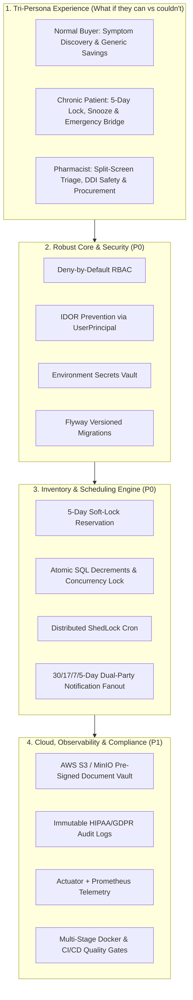
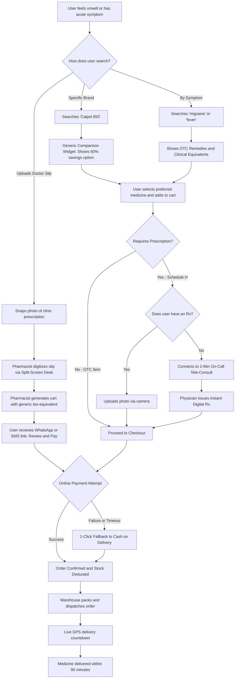
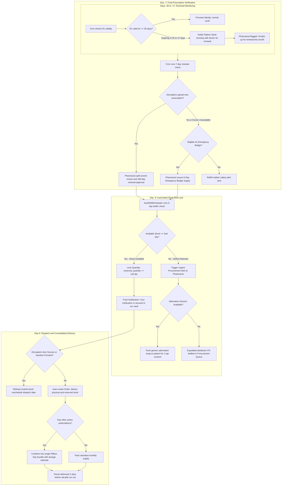
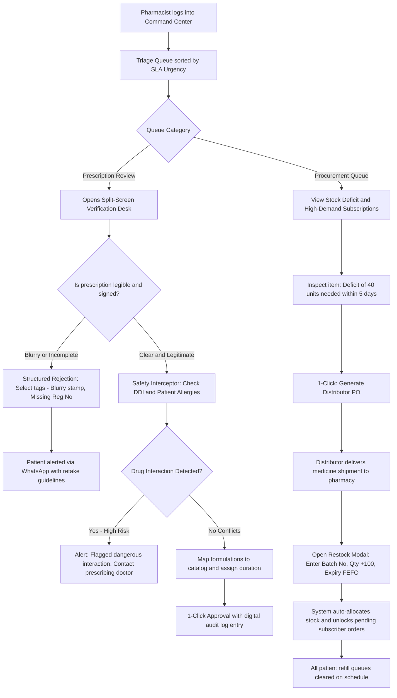

# 🏥 Auto-Meds: Complete User-Centric & Production-Ready Blueprint

This document represents the master specification for taking **Auto-Meds** from its current prototype state to an **enterprise-grade, clinical, and commercially viable production platform**.

It consolidates technical architecture, data integrity, security, two-way notifications, high-concurrency inventory reservation, and the dual-perspective analysis (**"What if they can?" vs. "What if they couldn't?"**) for every user persona.

---

## 🏛️ System Architectural Pillars



---

## 👥 Section 1: User Experience & Resilience Design ("Can" vs. "Couldn't")

A production healthcare system must excel when things go right, but must have bulletproof fallbacks when real life breaks the flow.

### 1.1 🧑 The Normal / Casual Shopper (Acute Needs)
* **What if they CAN?**
  * **Symptom-Based Search**: Search *"severe migraine"* or *"acid reflux"* rather than having to know exact active pharmaceutical ingredients.
  * **Generic Price Savings**: Instant visual savings comparison on drug detail cards (*"Brand A ₹120 vs. Generic Equivalent ₹45 — Save 62%"*).
  * **Clear Badging**: OTC (immediate purchase) vs. Schedule H (prescription upload required).
* **What if they COULDN'T?**
  * *Couldn't find the prescribed brand?* $\rightarrow$ Suggest exact chemical composition + strength matches with high clinical confidence badges.
  * *Couldn't read messy doctor handwriting?* $\rightarrow$ **"Prescription OCR & Pharmacist AI Co-pilot"**: User uploads raw image; OCR pre-processes the document, extracts drug names and dosages, and pre-populates candidate matches with confidence tags for 1-click verification.
  * *Couldn't provide a prescription for acute Rx meds?* $\rightarrow$ 1-click tele-consultation bridge connecting to an on-call physician for an e-script.
  * *Payment gateway fails?* $\rightarrow$ Cart state is preserved with automatic retry and seamless fallback to Cash on Delivery (COD).

### 1.2 👵 The Chronic Patient (Long-Term Subscriber)
* **What if they CAN?**
  * **5-Day Safe Lock**: 5 days prior to medication depletion, stock is physically reserved in the warehouse; ad-hoc walk-ins cannot buy it out.
  * **Predictable Delivery**: Refill dispatches automatically 2 days before current supply exhausts.
  * **Refill Synchronization ("Pillbox Day")**: Synchronize different recurring medications (e.g., Blood Pressure, Diabetes, Cholesterol) to ship together in a single monthly parcel.
* **What if they COULDN'T?**
  * *Couldn't get a renewed prescription in time (Doctor unavailable)?* $\rightarrow$ **Emergency 5-Day Bridge Supply**: Pharmacist can authorize a 5-day stopgap supply of non-narcotic maintenance medication to avoid dangerous withdrawal.
  * *Couldn't afford the full bundle this month?* $\rightarrow$ Item-level selective skip (e.g., pause multivitamin, keep heart medication) and 1-click downgrade to lower-cost generics.
  * *Couldn't receive delivery (Traveling / On Vacation)?* $\rightarrow$ **Snooze by 7–14 days** or specify an alternate forwarding address for that specific cycle.
  * *Elderly patient couldn't navigate web UI?* $\rightarrow$ **Caregiver Proxy Access** (family member gets notifications and pays) + 1-word WhatsApp reply (`"CONFIRM"`) replenishment.

### 1.3 💊 The Pharmacist & Pharmacy Admin
* **What if they CAN?**
  * **Split-Screen Verification Desk**: High-resolution zoomable prescription scan on the left; drug catalog selector, dosage, and duration matcher on the right.
  * **Predictive Procurement**: Dashboard displays total locked inventory, active subscription demand, and distributor reorder recommendations.
* **What if they COULDN'T?**
  * *Couldn't read the uploaded prescription (Blurry / Dark)?* $\rightarrow$ **Structured Rejection Flow**: Pharmacist selects quick tags (*"Blurry stamp"*, *"Missing doctor registration number"*); patient gets an instant WhatsApp prompt with retake guidelines.
  * *Risk of dispensing wrong strength or Look-Alike medication?* $\rightarrow$ **"Four-Eyes Principle" Order-Prescription Double-Check Chain**: Prescription is attached directly to the order (`orders.prescription_id`). Warehouse packers cross-verify physical strips against the prescription scan on the packing slip before sealing boxes, and patients receive a doorstep dispensing slip with QR code to double-check their delivered medicines.
  * *Couldn't restock from distributor in time (Supply Shortage)?* $\rightarrow$ **Alternative Recommendation Push**: Pharmacist selects an in-stock generic equivalent; patient receives a 1-tap consent prompt to swap formulations.
  * *Couldn't verify safety manually (Drug-Drug Interactions)?* $\rightarrow$ **Automated DDI & Allergy Interceptor**: System detects conflicting drugs or known patient allergies and displays prominent clinical warnings.
  * *Overloaded with verification volume during peak hours?* $\rightarrow$ **SLA Urgency Queuing**: Critical 5-day refills due today appear at the top in red; routine 30-day early renewals sit in standard priority.


---

## 🔒 Section 2: Security, Access Control & API Architecture (P0)

### 2.1 Deny-by-Default Spring Security
Rewrite [SecurityConfig.java](file:///c:/Users/KIIT/Desktop/auto-meds/auto-meds-backend/auto-meds-backend/src/main/java/com/automeds/config/SecurityConfig.java) from `.anyRequest().permitAll()` to explicit role isolation:
```java
http.authorizeHttpRequests(auth -> auth
    // Public Endpoints
    .requestMatchers("/api/auth/**", "/api/medicines/search", "/actuator/health").permitAll()
    // Admin Only
    .requestMatchers("/api/admin/**").hasAuthority("ROLE_ADMIN")
    // Pharmacist & Clinical Gateway
    .requestMatchers("/api/pharmacist/**", "/api/prescriptions/verify/**").hasAnyAuthority("ROLE_ADMIN", "ROLE_PHARMACIST")
    // Patient Authenticated Routes
    .requestMatchers("/api/patient/**", "/api/subscriptions/**", "/api/orders/**", "/api/cart/**").hasAuthority("ROLE_PATIENT")
    // Everything else blocked
    .anyRequest().authenticated()
);
```

### 2.2 IDOR Elimination via Injected UserPrincipal
Remove client-supplied `patientId` query and path parameters. Always resolve the actor from the JWT token context:
```java
@PostMapping("/checkout")
public ResponseEntity<OrderDTO> checkout(
    @AuthenticationPrincipal UserPrincipal currentUser, 
    @Valid @RequestBody CheckoutRequest request) {
    return ResponseEntity.ok(orderService.checkoutCart(currentUser.getId(), request));
}
```

### 2.3 Secrets Management & Token Security
* Extract all DB credentials, mail secrets, and JWT private keys into OS/Docker environment variables (`${DB_PASSWORD}`, `${JWT_SECRET}`).
* Replace long-lived static tokens with **15-minute Access Tokens** paired with **30-day Refresh Tokens** stored in `HttpOnly; Secure; SameSite=Strict` cookies.
* Implement standardized RFC 7807 `ProblemDetail` error responses in [GlobalExceptionHandler.java](file:///c:/Users/KIIT/Desktop/auto-meds/auto-meds-backend/auto-meds-backend/src/main/java/com/automeds/exception/GlobalExceptionHandler.java).

---

## ⚡ Section 3: Concurrency, Inventory Soft-Lock & Notifications (P0)

### 3.1 5-Day Soft-Lock Reservation Implementation
Update [Medicine.java](file:///c:/Users/KIIT/Desktop/auto-meds/auto-meds-backend/auto-meds-backend/src/main/java/com/automeds/entity/Medicine.java):
```java
@Column(name = "stock_quantity", nullable = false)
private Integer stockQuantity; // Total physical count in warehouse

@Column(name = "reserved_quantity", nullable = false)
private Integer reservedQuantity = 0; // Locked for subscriptions approaching refill

public Integer getAvailableQuantity() {
    return Math.max(0, this.stockQuantity - this.reservedQuantity);
}
```

* **Ad-Hoc Protection**: All public purchases validate against `getAvailableQuantity()`, ensuring walk-in buyers cannot deplete locked medication.
* **Refill Execution (Day 0)**:
  ```sql
  UPDATE medicines 
  SET stock_quantity = stock_quantity - :qty, 
      reserved_quantity = reserved_quantity - :qty 
  WHERE id = :id;
  ```
* **Cancellation / Snooze**:
  ```sql
  UPDATE medicines SET reserved_quantity = reserved_quantity - :qty WHERE id = :id;
  ```

### 3.2 Atomic Concurrency Defense
Prevent negative stock during flash sales or concurrent checkouts using atomic database-level decrements:
```sql
UPDATE medicines SET stock_quantity = stock_quantity - :qty 
WHERE id = :id AND stock_quantity >= :qty;
```

### 3.3 Distributed Cron with ShedLock
Prevent multi-pod duplicated executions of [AutoRefillScheduler.java](file:///c:/Users/KIIT/Desktop/auto-meds/auto-meds-backend/auto-meds-backend/src/main/java/com/automeds/scheduler/AutoRefillScheduler.java):
```java
@Scheduled(cron = "0 0 0 * * ?")
@SchedulerLock(name = "AutoRefillScheduler_processAutoRefills", lockAtLeastFor = "PT5M", lockAtMostFor = "PT30M")
public void processAutoRefills() { ... }
```

### 3.4 Multi-Interval Dual Notifications & Reorder Workflow
Update notification intervals to **30, 17, 7, and 5 days**, broadcasting to both parties:

| Interval | 👨‍⚕️ Patient Notification | 💊 Pharmacist Alert & Workflow |
|---|---|---|
| **30 Days** | Renewal reminder: book doctor visit | Added to "Upcoming Renewals" forecast |
| **17 Days** | Mid-term reminder with upload link | Monitored in pending renewals |
| **7 Days** | Urgent: 7 days until refill halted | High-priority patient engagement flag |
| **5 Days** | 🔒 *"Medicine locked in stock for your refill"* | 📦 Stock soft-lock confirmed in warehouse |
| **Stockout / Deficit** | ⚠️ *"Stockout: We are sourcing alternatives"* | 🚨 **URGENT**: Added to **Pharmacist Reorder Queue** with supplier PO generator |

---

## 🗄️ Section 4: Data, Cloud, Observability & Compliance (P1)

1. **Database Migrations (Flyway)**:
   * Disable `spring.jpa.hibernate.ddl-auto=update` in favor of `validate`.
   * Add version-controlled migration scripts (`V1__initial_schema.sql`, `V2__inventory_reservation.sql`).
2. **Cloud Document Storage**:
   * Migrate from local disk (`uploads/prescriptions`) to **AWS S3 / MinIO**.
   * Serve prescription assets via **15-minute Pre-Signed URLs** to guarantee HIPAA/GDPR medical record confidentiality.
3. **Immutable Compliance Audit Trail**:
   * Append-only `audit_logs` capturing:
     `id`, `actor_id`, `actor_role`, `action` (e.g. `APPROVED_RX`, `EMERGENCY_BRIDGE_DISPENSED`), `resource_id`, `ip_address`, `timestamp`.
4. **Production Observability**:
   * Spring Boot Actuator (`/actuator/health`, `/actuator/metrics`).
   * Prometheus scrape endpoints for monitoring HikariCP connection pool health and scheduler durations.
   * Correlation IDs (`X-Correlation-ID`) across Angular HTTP interceptors and Spring Boot MDC logging.

---

## 🚀 Step-by-Step Implementation Roadmap

| Phase | Milestone | Primary Deliverables |
|---|---|---|
| **Phase 1: Security & Identity (P0)** | Secure the gateway & eliminate IDOR | Harden `SecurityConfig.java`, inject `@AuthenticationPrincipal`, sanitize error responses with RFC 7807 `ProblemDetail`. |
| **Phase 2: Inventory Soft-Lock & ShedLock (P0)** | Guarantee subscriber stock | Add `reserved_quantity`, implement 5-day soft-lock, add atomic SQL decrements, add ShedLock to `AutoRefillScheduler.java`. |
| **Phase 3: Dual Notification Cadence & Procurement (P0)** | Proactive alerts & reorders | Expand scheduler to 30/17/7/5 days, fan out to pharmacists, build Pharmacist Reorder & Restock Queue on frontend. |
| **Phase 4: Persona UX Upgrades (P1)** | Real-world resilience flows | Split-screen prescription triage, DDI safety checks, patient "Snooze/Sync Refills", generic savings widget. |
| **Phase 5: Cloud Storage & DevOps (P1)** | Cloud-native deployment | S3 pre-signed URLs, Flyway migrations, multi-stage Dockerfiles, and GitHub Actions CI pipeline. |

---

## 🎬 Section 7: Post-Completion Visual User Flows (By Persona)

Here are the dedicated, visual end-to-end user journeys for each persona once the full production platform is live.

---

### 1. 🧑 Casual / Acute Buyer: Symptom to Doorstep Flow



---

### 2. 👵 Chronic Patient: 30-Day Auto-Refill & 5-Day Soft-Lock Lifecycle



---

### 3. 💊 Licensed Pharmacist & Admin: Clinical Verification & Procurement Flow




