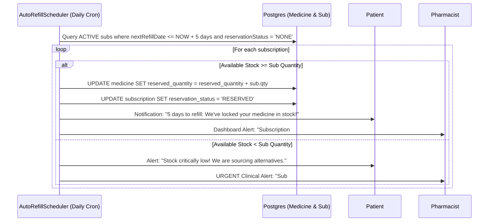
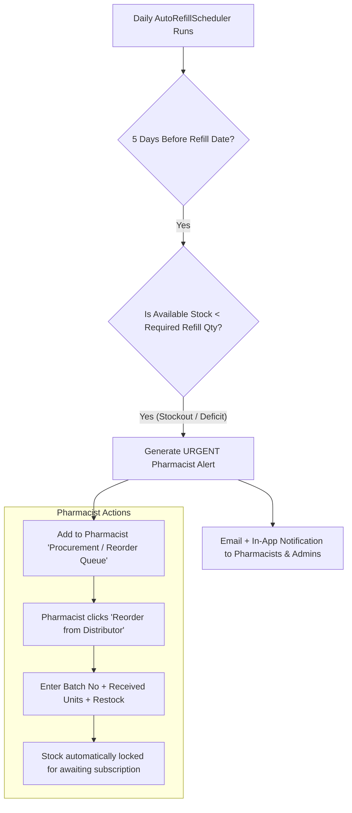

# 💬 Auto-Meds: Full Unabridged Senior Engineer Discussion Transcript
**Session Start:** "act as senior software engineer what more changes you would recomend in this project that would make it more like a production kind of project so that we can take it on a whole new level"  
**Date:** September 25, 2026

---

## 🗣️ User Prompt 1
> **act as senior software engineer what more changes you would recomend in this project that would make it more like a production kind of project so that we can take it on a whole new level**

### 🤖 Assistant Response 1

Here is a comprehensive, senior software engineering critique and production-readiness roadmap for **Auto-Meds**.

Your domain (e-pharmacy, automated refills, and clinical prescription verification) is high-stakes. Making this project **true production-grade** requires moving beyond typical student or demo implementations to enterprise resiliency, data consistency, regulatory compliance, and observability.

---

### 1. 🚨 Critical Security & Authentication Hardening

#### A. Tighten Spring Security Authorization
* **Current State**: In `SecurityConfig.java`, `.anyRequest().permitAll()` is enabled, with only `/api/auth/register-admin` guarded.
* **Production Fix**: Flip to a **Deny-by-Default** model:
  ```java
  .authorizeHttpRequests(auth -> auth
      .requestMatchers("/api/auth/**", "/api/medicines/**", "/actuator/health").permitAll()
      .requestMatchers("/api/admin/**").hasAuthority("ROLE_ADMIN")
      .requestMatchers("/api/pharmacist/**").hasAnyAuthority("ROLE_ADMIN", "ROLE_PHARMACIST")
      .requestMatchers("/api/patient/**", "/api/orders/**", "/api/subscriptions/**").authenticated()
      .anyRequest().authenticated()
  )
  ```
* **Inject Principal Context**: Replace passing `patientId` as query parameters or path variables in endpoints like `checkoutCart(Long patientId)`. Resolve the user from `SecurityContextHolder.getContext().getAuthentication()` to prevent **Insecure Direct Object Reference (IDOR)** attacks where Patient A checks out or reads Patient B's cart.

#### B. Rotate Secrets & Externalize Configurations
* **Current State**: Plaintext DB passwords (`spring.datasource.password=REDACTED_DB_PASSWORD`) and hardcoded JWT secrets are stored in `application.properties`.
* **Production Fix**: Read secrets through environment variables or a secret vault:
  ```properties
  spring.datasource.password=${DB_PASSWORD}
  jwt.secret=${JWT_SECRET}
  ```
* Introduce **Refresh Tokens** stored in `HttpOnly, Secure, SameSite=Strict` cookies alongside short-lived (15-min) Access Tokens to allow revocations without re-login fatigue.

---

### 2. ⚡ High-Concurrency & Inventory Consistency

#### A. Prevent Race Conditions on Medicine Stock
* **Current State**: Checking stock with `medicine.getStockQuantity() >= sub.getQuantity()` and decrementing it later creates a classic **Time-of-Check to Time-of-Use (TOCTOU)** race condition when concurrent checkouts occur.
* **Production Fix**:
  1. Use **Pessimistic Locking** on inventory checks:
     ```java
     @Lock(LockModeType.PESSIMISTIC_WRITE)
     @Query("SELECT m FROM Medicine m WHERE m.id = :id")
     Optional<Medicine> findByIdForUpdate(@Param("id") Long id);
     ```
  2. Or use an **Atomic Decrement** update query:
     ```sql
     UPDATE medicines SET stock_quantity = stock_quantity - :qty 
     WHERE id = :id AND stock_quantity >= :qty;
     ```
     If rows affected is `0`, throw `InsufficientStockException`.

#### B. Idempotency on Payment & Checkout
* Add an `Idempotency-Key` HTTP header on `/api/orders/checkout`.
* Cache the key in Redis with a 5-minute TTL. This prevents duplicate charges and duplicate orders when users double-click "Place Order" or network retries occur.

---

### 3. 🔄 Scalable Background Processing & Distributed Schedulers

#### A. Distributed Locking for AutoRefillScheduler
* **Current State**: `AutoRefillScheduler.java` uses `@Scheduled(cron = "0 0 0 * * ?")`. If you scale to 2 or more backend instances/containers, **all instances will run the cron at midnight and place duplicate orders**.
* **Production Fix**:
  * Integrate **ShedLock** with PostgreSQL or Redis:
    ```java
    @Scheduled(cron = "0 0 0 * * ?")
    @SchedulerLock(name = "AutoRefillScheduler_process", lockAtLeastFor = "PT5M", lockAtMostFor = "PT30M")
    public void processAutoRefills() { ... }
    ```

#### B. Event-Driven Architecture (EDA) & Message Queues
* Split high-latency operations out of the user-facing request thread:
  * **Emails & Notifications**: Push to RabbitMQ or Apache Kafka; process via worker consumers with exponential backoff and dead-letter queues (DLQs).
  * **Prescription OCR & Validation**: Heavy file processing shouldn't block HTTP worker threads.

---

### 4. 🗄️ Database Evolution, Integrity & Storage

#### A. Database Migrations (Flyway / Liquibase)
* **Current State**: `spring.jpa.hibernate.ddl-auto=update` is used.
* **Production Fix**: Never run `ddl-auto=update` in production. It risks accidental column drops, unoptimized foreign key locks, or silent failures.
  * Switch to `spring.jpa.hibernate.ddl-auto=validate`.
  * Add **Flyway** (`flyway-core`) with numbered migration scripts (`V1__init_schema.sql`, `V2__add_indexes.sql`).

#### B. Prescription Cloud Storage (S3 / GCS)
* **Current State**: Local disk storage `uploads/prescriptions`.
* **Production Fix**: In multi-instance deployments (containers, Kubernetes), local disk storage is ephemeral and unshared.
  * Abstract prescription storage behind an `ObjectStorageService` using AWS S3 or MinIO.
  * Store files encrypted at rest (SSE-S3 or KMS).
  * Serve files through short-lived **Pre-signed URLs** instead of public static file serving.

---

### 5. 🏥 Healthcare Compliance & Audit Logging (HIPAA/CDSCO/GDPR)

* **Immutable Audit Trail**: In e-pharmacy systems, prescription approval/rejection and medicine dispensing must have non-repudiable audit trails:
  * Create an `audit_logs` table tracking: `actor_user_id`, `action` (e.g., `APPROVED_PRESCRIPTION`, `DISPATCHED_ORDER`), `resource_id`, `client_ip`, and `timestamp`.
  * Track reason codes for pharmacist rejections.
* **Data Privacy (PII/PHI)**: Mask phone numbers and patient addresses in application logs. Ensure patient medical records and uploaded prescriptions are only accessible to assigned pharmacists and the patient.

---

### 6. 📊 Production Observability & Reliability

* **Spring Boot Actuator & Micrometer/Prometheus**: Add `spring-boot-starter-actuator` to expose `/actuator/health` and `/actuator/metrics` for Kubernetes readiness/liveness probes.
* **Structured JSON Logging**: Replace string formatting with structured logback JSON (e.g., Logstash Logback Encoder) with `traceId` and `spanId` using Micrometer Tracing.
* **Database Connection & Circuit Breakers**:
  * Implement **Resilience4j** circuit breakers on external payment gateways and mail servers.
  * Monitor HikariCP pool metrics (`hikaricp.connections.active`, `hikaricp.connections.pending`).

---

### 7. 🐳 Cloud-Native Packaging & CI/CD Pipeline

* **Multi-Stage Dockerfiles**:
  * Build frontend with Node, serve production assets via Nginx alpine with gzip/brotli compression.
  * Build backend with Maven, run lightweight JRE 17 container using non-root user.
* **Docker Compose for Local Staging**:
  * A single `docker-compose.yml` spinning up PostgreSQL, Redis, Backend, Frontend, and Mailhog.
* **GitHub Actions CI/CD**:
  * Enforce unit test passes, Jacoco coverage thresholds ($\ge 80\%$), SonarQube quality gates, and automated container image builds on every PR.

---

## 🗣️ User Prompt 2
> **Focus on areas such as:
> Better UI/UX and responsive design
> Authentication and authorization
> Role-based access control
> Input validation and error handling
> Secure API design
> Proper database design and optimization
> Pagination, filtering, sorting and search
> Better loading, empty and error states
> Notifications
> User activity/history
> Admin functionality and dashboards
> Audit logs
> File handling where relevant
> Performance optimization
> Logging and monitoring
> API documentation
> Unit and integration testing
> Security improvements
> Environment-based configuration
> Proper project structure and clean architecture
> Scalability and maintainability
> Deployment readiness
> Realistic business workflows
> Any other features commonly expected in production applications**

### 🤖 Assistant Response 2

An enterprise-grade production platform in healthcare/e-pharmacy requires strict adherence to security, data integrity, user trust, and operational resilience. 

Here is a senior engineering blueprint organized across your target dimensions, comparing **current code gaps** with **concrete production implementations**.

---

### 1. 🔐 Authentication, Authorization & RBAC

#### 1.1 Strict Route Guarding & "Deny-by-Default" Security
* **Problem**: `SecurityConfig.java` currently ends with `.anyRequest().permitAll()`. Any unauthenticated client can call order, prescription, or user APIs.
* **Production Recommendation**:
  * Implement strict endpoint segmentation:
    * `/api/auth/**`, `/api/medicines/search`, `/actuator/health` $\rightarrow$ `permitAll()`
    * `/api/admin/**` $\rightarrow$ `hasRole('ADMIN')`
    * `/api/pharmacist/**` $\rightarrow$ `hasAnyRole('ADMIN', 'PHARMACIST')`
    * `/api/patient/**`, `/api/subscriptions/**`, `/api/orders/**` $\rightarrow$ `hasRole('PATIENT')`
  * Add `@EnableMethodSecurity(prePostEnabled = true)` so services and controllers can enforce `@PreAuthorize("hasRole('ADMIN') or #patientId == authentication.principal.id")`.

#### 1.2 Eliminate IDOR (Insecure Direct Object Reference)
* **Problem**: Passing `patientId` as a query param (e.g., `checkoutCart(Long patientId)`) allows Patient A to checkout or read Patient B's cart by swapping IDs.
* **Production Recommendation**:
  * Extract the authenticated user directly from the Spring Security context:
    ```java
    @PostMapping("/checkout")
    public ResponseEntity<OrderDTO> checkout(
        @AuthenticationPrincipal UserPrincipal currentUser,
        @Valid @RequestBody CheckoutRequest request) {
        return ResponseEntity.ok(orderService.checkoutCart(currentUser.getId(), request));
    }
    ```

#### 1.3 Dual-Token Strategy (Access + Refresh) & Session Invalidation
* Implement short-lived JWT Access Tokens (15 mins) and persist Refresh Tokens (7-30 days) hashed in a `refresh_tokens` table.
* Store refresh tokens in `HttpOnly; Secure; SameSite=Strict` cookies.
* Support instant token revocation on password reset or account logout.

---

### 2. 🛡️ Secure API Design, Input Validation & Global Error Handling

#### 2.1 RFC 7807 Problem Details Standard
* **Current State**: `GlobalExceptionHandler.java` returns arbitrary custom JSON maps.
* **Production Recommendation**:
  * Adopt Spring 6/Boot 3's native `ProblemDetail` (RFC 7807):
    ```json
    {
      "type": "https://automeds.com/errors/insufficient-stock",
      "title": "Insufficient Stock",
      "status": 400,
      "detail": "Requested 30 units of Metformin 500mg, but only 12 are available.",
      "instance": "/api/orders/checkout",
      "timestamp": "2026-09-25T16:50:00Z"
    }
    ```
  * **Sanitize Stack Traces**: Never return `ex.getMessage()` on unhandled 500 errors to avoid leaking internal SQL queries or server paths.

#### 2.2 Rate Limiting & Abuse Prevention
* Implement token-bucket rate limiting via **Bucket4j** (or API Gateway/Nginx) on sensitive endpoints:
  * `/api/auth/login`: 5 attempts / minute per IP (prevents brute-force credential stuffing).
  * `/api/prescriptions/upload`: 10 requests / minute (prevents storage flooding).

#### 2.3 API Versioning
* Introduce URI versioning (`/api/v1/...`) to prevent breaking changes when mobile apps or third-party integrations are released.

---

### 3. 💾 Database Design, Optimizations & Concurrency Control

#### 3.1 Versioned Migrations (Flyway)
* **Replace** `spring.jpa.hibernate.ddl-auto=update` with `validate` in production.
* Add **Flyway** (`db/migration/V1__init_schema.sql`, `V2__add_performance_indexes.sql`). This ensures automated, reproducible schema transitions across Dev, Staging, and Production.

#### 3.2 Inventory Race Condition Prevention (Pessimistic/Optimistic Locking)
* Prevent overselling during simultaneous checkouts:
  ```java
  // In MedicineRepository:
  @Modifying
  @Query("UPDATE Medicine m SET m.stockQuantity = m.stockQuantity - :qty WHERE m.id = :id AND m.stockQuantity >= :qty")
  int deductStockIfAvailable(@Param("id") Long id, @Param("qty") Integer qty);
  ```
  If returned rows updated is `0`, immediately abort and inform the user that stock was depleted.

#### 3.3 Composite Indexes & Full-Text Search
* Add composite B-tree indexes for hot query paths:
  * `CREATE INDEX idx_subscriptions_status_refill ON subscriptions(status, next_refill_date);`
  * `CREATE INDEX idx_medicines_comp_strength ON medicines(composition, strength) WHERE active = 1;`
* Use PostgreSQL `tsvector` + GIN index for fuzzy medicine search instead of costly `ILIKE '%term%'` full-table scans.

#### 3.4 Soft Deletes & Temporal Auditing
* Add `@SQLDelete(sql = "UPDATE medicines SET deleted = true WHERE id = ?")` and `@Where(clause = "deleted = false")`.
* Enable Hibernate Envers or JPA Auditing (`@CreatedDate`, `@LastModifiedDate`, `@CreatedBy`) across all transaction entities.

---

### 4. 📄 Pagination, Filtering, Sorting & Search Architecture

* **Backend**: Replace unpaginated `findAll()` queries with Spring Data `Pageable`:
  ```java
  @GetMapping
  public ResponseEntity<Page<MedicineDTO>> listMedicines(
      @RequestParam(required = false) String search,
      @RequestParam(required = false) String category,
      @PageableDefault(page = 0, size = 20, sort = "medicineName", direction = Sort.Direction.ASC) Pageable pageable) { ... }
  ```
* **Frontend**:
  * Use URL query parameters (`?page=1&size=20&sort=price,desc`) so users can bookmark or share filtered views.
  * Debounce search inputs by 300ms using RxJS `debounceTime(300)` and `distinctUntilChanged()`.

---

### 5. 🎨 UI/UX, Component States & Responsive Design

#### 5.1 Comprehensive UI States
* Replace generic blank screens or simple spinners with three distinct component states:
  1. **Loading State**: Content-shaped **Skeleton loaders** (`ngx-skeleton-loader`) to minimize perceived latency.
  2. **Empty State**: Illustrated placeholders with actionable CTAs (e.g., *"No active subscriptions found. Browse medicines to set up auto-refill"*).
  3. **Error State**: Non-blocking toast notifications for warnings; retry banners (`"Failed to load inventory. [Retry]"`) for critical sections.

#### 5.2 Mobile-First Responsive Breakpoints
* Convert the Admin and Pharmacist tables into stacked card layouts on viewports `< 768px`.
* Add sticky headers and bottom navigation bars for quick one-thumb interaction on mobile web.

---

### 6. 🔔 Notifications, WebSockets & User Activity Tracking

* **Real-Time Updates via WebSockets (STOMP / SSE)**:
  * When a pharmacist approves/rejects a prescription or an auto-refill order is created, push immediate updates to the patient's active session without requiring page refreshes.
* **Notification Preferences & Multi-Channel Fallback**:
  * Allow users to toggle notification channels: In-App, Email, and SMS/WhatsApp (e.g., Twilio/Gupshup).
* **User Activity Timeline**:
  * Build a dedicated `/activity` tab for patients showing milestone logs: *"Refill #104 dispatched"*, *"Prescription uploaded"*, *"Prescription verified by Pharmacist Dr. Sharma"*.

---

### 7. 🛡️ Pharmacist & Admin Dashboard Improvements + Audit Logs

* **Two-Step Clinical Verification Flow**:
  * Prescription review screen with split-screen layout: scanned prescription PDF/image on the left; drug dosage and substitution catalog matcher on the right.
  * Require a mandatory clinical rejection reason (e.g., *"Dosage illegible"*, *"Expired doctor stamp"*).
* **Immutable Compliance Audit Log**:
  * Log every state change on orders and prescriptions into an append-only `audit_logs` table:
    * `actor_id`, `actor_role`, `action_type`, `entity_type`, `entity_id`, `old_value`, `new_value`, `ip_address`, `timestamp`.

---

### 8. 📁 Production File & Document Handling

* **Cloud Object Storage (S3 / GCS / Azure Blob)**:
  * Do not save files to local disk (`uploads/prescriptions`). Migrate to AWS S3 or MinIO.
* **Security Scanning & Validation**:
  * Validate MIME types using Apache Tika (magic bytes), not just file extensions (`.pdf`, `.jpg`, `.png`).
  * Enforce maximum upload limit (e.g., 5MB) and run an asynchronous virus/malware scan (ClamAV) before moving to permanent storage.
* **Pre-Signed URLs**:
  * Prevent public access to prescriptions. Serve files via short-lived (15-minute) pre-signed S3 download URLs.

---

### 9. 📈 Observability, Distributed Scheduling & Performance

#### 9.1 Distributed Schedulers (ShedLock)
* **Problem**: In `AutoRefillScheduler.java`, multi-pod horizontal scaling causes every pod to run midnight crons concurrently, duplicating orders.
* **Fix**: Wrap tasks with ShedLock:
  ```java
  @Scheduled(cron = "0 0 0 * * ?")
  @SchedulerLock(name = "AutoRefillScheduler_processAutoRefills", lockAtLeastFor = "PT5M", lockAtMostFor = "PT30M")
  public void processAutoRefills() { ... }
  ```

#### 9.2 Metrics, Health & Tracing
* Add `spring-boot-starter-actuator` + Micrometer Prometheus.
* Export metrics: HTTP response latencies (p95, p99), active HikariCP pool usage, and scheduler execution times.
* Structured logging with Correlation IDs (`X-Correlation-ID`) across Angular HTTP interceptors and Spring Boot MDC filters.

---

### 10. 🧪 Testing Strategy & Quality Gates

* **Unit Testing**: JUnit 5 + Mockito achieving $>80\%$ branch coverage on business-critical logic (`OrderService`, `SubscriptionService`, `AutoRefillScheduler`).
* **Integration Testing**: Use **Testcontainers** for spinning up real PostgreSQL and Redis instances during `mvn verify`, avoiding H2 in-memory quirks.
* **Frontend Testing**: Jasmine/Karma unit tests for components + Cypress or Playwright end-to-end tests for the complete checkout and prescription verification workflow.

---

### 11. 🚢 DevOps, Environment Configuration & CI/CD

* **Multi-Stage Docker Builds**:
  * Backend: OpenJDK Alpine runtime running as a non-privileged `automeds` system user.
  * Frontend: Node builder $\rightarrow$ Alpine Nginx with brotli compression, HTTP/2, and security headers (`Content-Security-Policy`, `X-Frame-Options: DENY`).
* **Environment Separation**:
  * Create `application-dev.yml`, `application-staging.yml`, and `application-prod.yml`.
  * Inject credentials strictly via environment variables or cloud secret managers.

---

### 🚀 Recommended Phased Implementation Roadmap Table

| Phase | Milestone | Primary Deliverables |
|---|---|---|
| **Phase 1: Security & Stability (P0)** | Lock down core APIs | Rewrite `SecurityConfig.java` with deny-by-default RBAC, extract authenticated user principals, externalize credentials. |
| **Phase 2: Data Integrity & DB (P0)** | Eliminate race conditions | Atomic stock decrement queries, ShedLock for `AutoRefillScheduler.java`, Flyway database migrations. |
| **Phase 3: UX & Pagination (P1)** | Enterprise UI/UX | Spring Pageable endpoints, Angular skeleton loaders, empty states, search debouncing. |
| **Phase 4: Cloud & Compliance (P1)** | Storage & Audit | S3 pre-signed prescription uploads, append-only `AuditLog` service, RFC 7807 problem details. |
| **Phase 5: DevOps & Monitoring (P2)** | Production Readiness | Multi-stage Dockerfiles, Actuator + Prometheus metrics, GitHub Actions CI pipeline. |

---

## 🗣️ User Prompt 3
> **see for the subscription patient and pharmacist both will get updates like 30 days 17 then 7 then five like that?**

### 🤖 Assistant Response 3

### How It Currently Works vs. What Needs to Be Fixed

In your current code:

1. **Only the Patient gets notified — Pharmacists are never alerted.**
   As seen in `AutoRefillScheduler.java (lines 94–105)`:
   ```java
   notificationService.createNotification(
       sub.getPatient().getId(),   // <-- ONLY sent to patient ID
       "Prescription Expiring Soon",
       ...
   );
   ```
   Pharmacists and admins do not receive any notification or digest.

2. **The intervals currently coded are only `30, 15, 7` days, and only check *Prescription Expiry* (not Refill Depletion).**
   * The check is strictly hardcoded to:
     ```java
     if (daysUntilExpiry == 30 || daysUntilExpiry == 15 || daysUntilExpiry == 7)
     ```
   * It misses **17 days, 5 days, and 3 days**.
   * It only evaluates when the **prescription document expires**, not when the **patient's current medicine supply runs low** (which is driven by `nextRefillDate`).
   * Because the scheduler only queries subscriptions where `nextRefillDate <= now + 5 days` (via `refillBufferDays = 5`), a subscription approaching refill in 30 or 15 days is **never evaluated** by that query in the first place.

---

### What a Production-Grade Implementation Looks Like

```
                      ┌────────────────────────────────────────┐
                      │     Daily Scheduled Cron (00:00)       │
                      └──────────────────┬─────────────────────┘
                                         │
                 ┌───────────────────────┴───────────────────────┐
                 ▼                                               ▼
   [Prescription Expiry Watcher]                   [Medication Supply Depletion Watcher]
   Check expiry date vs now                       Check nextRefillDate vs now
   Intervals: 30, 17, 7, 5, 2 days                Intervals: 14, 7, 5, 3, 1 days
                 │                                               │
        ┌────────┴────────┐                             ┌────────┴────────┐
        ▼                 ▼                             ▼                 ▼
 👨‍⚕️ Patient Alert    💊 Pharmacist Digest        👨‍⚕️ Patient Alert    📦 Pharmacist / Inventory
 "Your prescription   "Patient John's script      "Your refill will   "15 units of Metformin
 expires in 7 days.   expires in 7 days. Needs    dispatch in 5 days. needed for upcoming
 Upload renewal."     outreach / doctor sign-off" Confirm address."   refills. Check stock."
```

---

### Proposed Code Changes

#### 1. Add Support for Pharmacist & Admin Notification Fan-Out
In `NotificationService.java`, add a helper method to broadcast critical subscription & prescription events to all active pharmacists and admins:

```java
public void notifyStaffAndPatient(Long patientId, String title, String patientMsg, String staffMsg, String type) {
    // 1. Notify the patient
    createNotification(patientId, title, patientMsg, type);

    // 2. Notify all pharmacists & admins
    List<User> staff = userRepository.findByRoleIn(List.of("ROLE_PHARMACIST", "ROLE_ADMIN"));
    for (User s : staff) {
        createNotification(s.getId(), "[Clinical Alert] " + title, staffMsg, type);
    }
}
```

#### 2. Separate Refill Expiry Tracking in `AutoRefillScheduler.java`

Create two dedicated methods in your scheduler:

```java
// Configurable intervals: 30, 17, 7, 5 days
private static final Set<Long> ALERT_DAYS = Set.of(30L, 17L, 7L, 5L);

@Scheduled(cron = "0 0 2 * * ?") // Runs daily at 2:00 AM
public void sendPrescriptionExpiryAlerts() {
    List<Subscription> activeSubs = subscriptionRepository.findByStatus("ACTIVE");

    for (Subscription sub : activeSubs) {
        Prescription rx = sub.getPrescription();
        if (rx != null && rx.getExpiryDate() != null) {
            long daysLeft = ChronoUnit.DAYS.between(LocalDate.now(), rx.getExpiryDate().toLocalDate());

            if (ALERT_DAYS.contains(daysLeft)) {
                String patientMsg = String.format(
                    "Your prescription for %s expires in %d days (%s). Please upload a renewed prescription to avoid refill interruptions.",
                    sub.getMedicine().getMedicineName(), daysLeft, rx.getExpiryDate().toLocalDate()
                );

                String staffMsg = String.format(
                    "Prescription for Patient %s (%s) expires in %d days. Medicine: %s.",
                    sub.getPatient().getFullName(), sub.getPatient().getEmail(), daysLeft, sub.getMedicine().getMedicineName()
                );

                notificationService.notifyStaffAndPatient(
                    sub.getPatient().getId(), 
                    "Prescription Renewal Due (" + daysLeft + " Days Left)", 
                    patientMsg, 
                    staffMsg, 
                    daysLeft <= 5 ? "DANGER" : "WARNING"
                );
            }
        }
    }
}
```

---

## 🗣️ User Prompt 4
> **and what if we add like at around five days automatically same amount of medicine will get locked for the patient on pharmacist side for subscription so that it will stay in stock atleast for that person**

### 🤖 Assistant Response 4

That is an **industry-standard best practice** in e-pharmacy and supply chain management. In enterprise systems, this pattern is called **Inventory Reservation (or Soft Allocation)**.

---

### Why this is critical for a Production E-Pharmacy

Without this feature, you run into this severe problem:
> A patient has subscribed for monthly Metformin that refills on the 30th. On the 28th, an ad-hoc regular buyer visits the site and buys out the remaining 20 boxes. When the patient's auto-refill triggers on day 30, **it fails due to stockout**, leaving a chronic patient without their essential medication.

By implementing an **automatic stock lock (soft reservation) 5 days prior to refill**:
1. Chronic patients are guaranteed their medication.
2. Ad-hoc buyers cannot purchase reserved stock.
3. The warehouse/pharmacist sees an exact breakdown: **Physical Stock**, **Reserved for Subscriptions**, and **Available to Sell**.

---

### How to Implement Inventory Reservation

#### 1. Data Model Enhancement
In `medicines` table (`Medicine.java`), distinguish between physical inventory and reserved inventory:

```java
@Column(name = "stock_quantity", nullable = false)
private Integer stockQuantity; // Total physical count in warehouse

@Column(name = "reserved_quantity", nullable = false)
private Integer reservedQuantity = 0; // Locked for subscriptions / pending checkouts

// Convenience business getter:
public Integer getAvailableQuantity() {
    return Math.max(0, this.stockQuantity - this.reservedQuantity);
}
```

---

#### 2. The 5-Day Auto-Lock Workflow in `AutoRefillScheduler.java`



---

#### 3. Protecting Ad-Hoc Checkouts
In `OrderService.java` and `CartService.java`, change the validation logic:

* **Before (Vulnerable)**:
  ```java
  if (medicine.getStockQuantity() < requestedQty) { throw new InsufficientStockException(...); }
  ```
* **Production Fix (Protected)**:
  ```java
  if (medicine.getAvailableQuantity() < requestedQty) {
      throw new InsufficientStockException(
          "Only " + medicine.getAvailableQuantity() + " units available for purchase (" 
          + medicine.getReservedQuantity() + " units are reserved for ongoing patient subscriptions)."
      );
  }
  ```

---

#### 4. Fulfilling or Releasing the Lock
* **When the Refill Executes (Day 0)**:
  When the automated order is generated and dispatched:
  ```sql
  UPDATE medicines 
  SET stock_quantity = stock_quantity - :qty,
      reserved_quantity = reserved_quantity - :qty
  WHERE id = :id;
  ```
* **If Patient Cancels/Pauses Subscription during the 5 days**:
  The reserved amount is immediately released back to general stock:
  ```sql
  UPDATE medicines SET reserved_quantity = reserved_quantity - :qty WHERE id = :id;
  ```

---

#### 5. Pharmacist & Admin Dashboard View
On the pharmacist's inventory table, display 3 clear badges:

| Medicine | Total Physical Stock | 🔒 Reserved (Subscriptions) | 🟢 Available to Sell | Action |
|---|---|---|---|---|
| **Metformin 500mg** | 50 boxes | **30 boxes (Locked)** | **20 boxes** | [Reorder Stock] |
| **Atorvastatin 10mg**| 12 boxes | **10 boxes (Locked)** | **2 boxes (Low!)** | ⚠️ Reorder Alert |

---

## 🗣️ User Prompt 5
> **and like also it could be like yaa pharmacist should get notified like yaa if out of stock reorder the medicines**

### 🤖 Assistant Response 5

In `AutoRefillScheduler.java (lines 146–147)`, the message said:
> *"Our warehouse has been notified."*

...but in reality, **no notification was actually sent to the warehouse, admin, or pharmacist!** The code only notified the patient.

Adding an **Automated Pharmacist Reorder Alert & Procurement System** completes this loop and makes the application mirror real-world hospital and pharmacy supply chain operations.

---

### How the Reorder Workflow Should Function



---

### Key Technical Implementations

#### 1. Real-Time Reorder Alerts to Pharmacists
When a medicine cannot be reserved or stock is $\le$ a threshold, trigger a direct alert to all users with `ROLE_PHARMACIST` and `ROLE_ADMIN`:

```java
// Inside AutoRefillScheduler when stock is insufficient for a subscription:
int deficit = sub.getQuantity() - (medicine.getStockQuantity() - medicine.getReservedQuantity());

List<User> pharmacists = userRepository.findByRoleIn(List.of("ROLE_PHARMACIST", "ROLE_ADMIN"));
for (User staff : pharmacists) {
    notificationService.createNotification(
        staff.getId(),
        "🚨 URGENT: Reorder Required for " + medicine.getMedicineName(),
        String.format(
            "Stockout Warning! Subscription #%d for patient %s requires %d units of %s (%s). Current available stock is 0. Deficit: %d units. Refill due in %d days. Please restock immediately.",
            sub.getId(), sub.getPatient().getFullName(), sub.getQuantity(), 
            medicine.getMedicineName(), medicine.getStrength(), deficit, refillBufferDays
        ),
        "DANGER"
    );
}
```

#### 2. Reorder Threshold & Suggested Reorder Quantity
In `Medicine.java`:
```java
@Column(name = "reorder_threshold", nullable = false)
private Integer reorderThreshold = 10; // Default safety threshold

@Column(name = "suggested_reorder_pack_size", nullable = false)
private Integer suggestedReorderPackSize = 50; // Suggested bulk pack purchase size
```

---

## 🗣️ User Prompt 6
> **what more suggestions you can give from both normal persion ,chronic patient, and pharmacist perspective**

### 🤖 Assistant Response 6

To take **Auto-Meds** to an authentic, high-impact enterprise level, design features around the specific anxieties, daily routines, and regulatory responsibilities of each stakeholder:

---

### 1. 🧑 Normal User / Occasional Buyer Perspective
*(Goal: Speed, confidence, affordability, and effortless checkout for acute ailments like fever, headache, allergies, or first aid)*

1. **"Shop by Symptom / Ailment" Flow**:
   * Users search *"runny nose"*, *"sneezing"*, or *"acidity"*. Add an ailment taxonomy: Fever, Acid Reflux, Pain Relief, Skin Rash, First Aid.
2. **Generic vs. Branded Cost-Savings Slider**:
   * *Brand: Calpol 650 (₹32)* vs. *Generic: Paracetamol 650 IP (₹12)* $\rightarrow$ **"Save 62% by choosing clinically equivalent generic."**
3. **One-Click Prescription Checkout (Rapid Rx)**:
   * Pharmacist reads uploaded photo, builds cart, texts/emails user: *"Your prescription has been reviewed. [Review & Pay ₹340 to dispatch]"*.
4. **Estimated Delivery Countdown & Live GPS Delivery Tracking**.
5. **OTC vs. Schedule H/X Rx Badging**.

---

### 2. 👵 Chronic Patient Perspective
*(Goal: Adherence, predictability, peace of mind, family caregiver controls, and zero medication stockouts)*

1. **"Snooze / Skip / Vacation Hold" Controls**:
   * Snooze by 7/14 days, change dispatch date, or adjust delivery address for the next cycle only.
2. **Multi-Medication Sync ("Pillbox Day")**:
   * A **"Sync My Refills"** button that aligns all refill dates to arrive together in a single consolidated box on the 1st of every month.
3. **Caregiver / Family Account Management**:
   * Caregiver receives CC'd refill notifications, expiration warnings, and can authorize payments.
4. **Interactive Pill Reminder & Adherence Log**.
5. **Doctor Appointment & Prescription Renewal Auto-Reminder**.

---

### 3. 💊 Pharmacist & Pharmacy Admin Perspective
*(Goal: Clinical safety, legal compliance, avoiding stockouts, liability protection, and operational speed)*

1. **Drug-Drug Interaction (DDI) & Allergy Warning Engine**:
   * When dispensing, flag major interactions: *Warfarin* + *Aspirin* $\rightarrow$ ⚠️ **"Potential Major Interaction Detected."**
2. **Split-Screen Clinical Verification Desk**:
   * Zoomable scanned prescription PDF on left; doctor registration, catalog medicines, dosage, and duration on right.
3. **Smart Batch & Expiry Management (FEFO - First Expired, First Out)**.
4. **Predictive Procurement & Refill Demand Forecast**.
5. **Controlled Substances / Schedule H Register (Audit Compliance)**.

---

### 🌟 High-Impact Roadmap Summary Table

| Dimension | Regular Shopper | Chronic Patient | Pharmacist / Admin |
|---|---|---|---|
| **Ordering** | "Shop by Symptom" & Generic price comparison | "Sync My Refills" (all drugs arrive together) | Split-screen prescription triage & digital verification |
| **Subscriptions** | Fast ad-hoc checkout | "Snooze / Vacation pause" & Caregiver access | 5-day soft inventory lock & batch allocation (FEFO) |
| **Safety & Ops** | Clear OTC vs. Rx drug tags | Adherence tracker & renewal appointment alerts | Drug-drug interaction (DDI) & allergy safety flags |
| **Inventory** | Live delivery ETA countdown | Guaranteed stock via auto-reservation | Predictive procurement & one-click distributor reordering |

---

## 🗣️ User Prompt 7
> **also like for the use cases i gave think in both perspective what if and what if it couldnt ... sorry not the use cases but the user**

### 🤖 Assistant Response 7

Here is the breakdown for the three core personas: **The Regular Person**, **The Chronic Patient**, and **The Pharmacist** evaluating **"What if they can?" (Happy Path)** vs. **"What if they couldn't?" (Resilience Fallback)**:

---

### 1. 🧑 The Normal / Casual User (Acute Buyer)

* **🟢 What if they CAN? (Optimal Journey)**:
  * Discovers medicine by symptom search (*"migraine"*), chooses a 55% cheaper generic equivalent, sees the OTC badge, and completes checkout in 90 seconds with live delivery tracking.
* **🔴 What if they COULDN'T? (Friction & System Safeguards)**:

| What if they couldn't... | Real-Life Situation | Production System Solution |
|---|---|---|
| **...get a prescription for a restricted drug?** | Need an antibiotic or Schedule H painkiller at 11:00 PM without paper Rx. | **Integrated Tele-Consultation Bridge**: Connects in 2 mins to an on-call physician for a digital prescription. |
| **...find their exact prescribed brand?** | Prescribed "Dolo 650" is completely out of stock. | **Clinical Generic Substitution with Confidence Badging**: Shows "Generic Paracetamol 650mg" with 100% bio-equivalence badge. |
| **...read the doctor's handwriting?** | Paper slip is illegible. | **"Upload Prescription & Pharmacist Will Build Your Cart"**: User uploads raw photo; pharmacist builds cart and sends SMS checkout link. |
| **...pay online (Payment Gateway Failure)?** | Bank server times out or UPI hangs. | **Automatic Idempotent Retry & COD Fallback**: Saves cart state; prompts 1-click switch to Cash on Delivery. |

---

### 2. 👵 The Chronic Patient (Long-Term Subscriber)

* **🟢 What if they CAN? (Optimal Journey)**:
  * Configures monthly maintenance medicines once. 5 days before exhaustion, medicines are locked in the vault. Box arrives 2 days early. Zero missed doses.
* **🔴 What if they COULDN'T? (Friction & System Safeguards)**:

| What if they couldn't... | Real-Life Situation | Production System Solution |
|---|---|---|
| **...get a renewed prescription in time?** | Doctor is on vacation; current prescription expired. | **5-Day Emergency Bridge Supply**: Pharmacist authorizes a one-time 5-day bridge supply of maintenance meds. |
| **...afford their monthly bundle this month?** | Financial pinch or lost income. | **Item-Level Selective Refill & Generic Downgrade**: Pause vitamins, keep cardiac meds; 1-click downgrade to generics. |
| **...receive the order because they are traveling?** | Visiting family in another city. | **"Vacation Pause & Alternate Address Forwarding"**: Snooze 15 days or deliver this single cycle to a vacation address. |
| **...use a smartphone or web app easily?** | Elderly patient has low tech literacy. | **Caregiver Proxy Access & WhatsApp Voice/Chatbot**: Family member manages account, or patient replies "CONFIRM" on WhatsApp. |
| **...take their medications as scheduled?** | Confused about dosage timings. | **Printed Color-Coded Schedule / Smart Blister Pack**: Includes morning/afternoon/night pill chart in delivery box. |

---

### 3. 💊 The Pharmacist & Pharmacy Admin

* **🟢 What if they CAN? (Optimal Journey)**:
  * Reviews prescriptions on dual-screen dashboard with catalog auto-match in 45 seconds. Inventory dials reflect real locked demand.
* **🔴 What if they COULDN'T? (Friction & System Safeguards)**:

| What if they couldn't... | Real-Life Situation | Production System Solution |
|---|---|---|
| **...read an uploaded prescription?** | Image is blurry or cut off. | **"Reject with Guided Correction" Workflow**: Selects quick tags ("Blurry stamp"); patient receives guidance to retake photo. |
| **...procure a medicine from the distributor in time?** | National distributor drug shortage. | **Pharmacist "Alternative Recommendation Push"**: Pushes equivalent in-stock generic to patient for 1-tap approval. |
| **...safely approve an Rx due to adverse drug interactions?** | Specialist prescribed drug that conflicts dangerously with current subscription. | **Automated DDI (Drug-Drug Interaction) Interceptor**: Flags major interaction warning before approval. |
| **...keep up with verification volume during peak hours?** | 200 prescriptions arrive on Monday morning. | **Priority Triaging & SLA Queuing**: Critical 5-day refills ranked in red; routine 30-day renewals in blue. |
| **...verify whether a prescription was already used elsewhere?** | Patient submits duplicate prescription to multiple accounts. | **Duplicate File Fingerprinting & Refill Cap Validation**: Uses perceptual image hashing (pHash) to detect duplicate uploads. |

